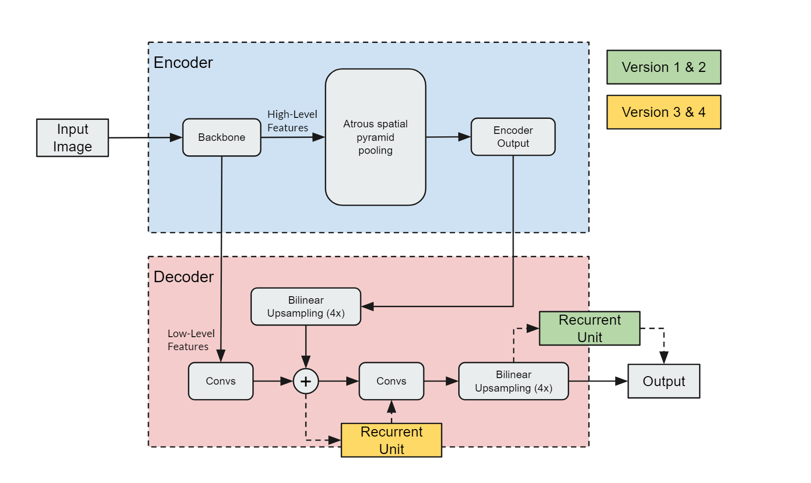

# On the Potential of Recurrent Structures for Semantic Video Segmentation with Deep Networks
(Code for the Bachelor's Thesis)

This Github Repositiory can be used to train different versions of the DeepLabV3+ (with additional Recurrent Units).

This code is designed to work on the Grid Computing Network from the Institute of Cognitive Science (IKW) Osnabrueck.
Training on local machines is also possible but some alternations to the code would be necessary.

If you are a member of the university of osnabrueck and have access to the grid network follow the 
[installation guidelines](#installation-guidelines) to train on the grid network. 

If you want to try the code locally see [Repository setup](#repository-setup) for some help.

##### Table of Contents  
[Installation Guidelines](#installation-Guidelines)  
[Grid Network Setup](#Grid-Network-Setups)   
[Setting up your scratch folder](#Setting-up-your-scratch-folder)   
[Dataset](#Dataset)   
[Preprocessing](#Preprocessing)   
[Starting the training](#Starting-the-training)   
[On the Grid Network](#On-the-Grid-Network)   
[Parameter adjustment of the sge files](#Parameter-adjustment-of-the-sge-files)   
[Example Config](#Example-Config)   
[Locally](#Locally)   
[Option 1](#Option-1)   
[Option 2](#Option-2)   
[Learning rate range test](#Learning-rate-range-test)   
[Evaluation](#Evaluation)   
[General Remark](#General-Remark)   
[References and changes](#References-and-changes)   
[Pip list](#Pip-list)   

# Results
<p align= "center">
    
</p>
<p align= "center">
    <em>DeeplabV3+ Architecture with additional Recurrent Units</em>
</p>
<br>
   
<p align= "center">
    
    
</p>
<p align= "center">
    <em> Visual Results of the MobileNetV2 Backbone Models (left) and Metric evaluation of the MobileNetV2 Backbone Models (right)</em>
</p>
<br>
   
<p align= "center">
    
    
</p>
<p align= "center">
    <em> Visual Results of the ResNet50 Backbone Models (left) and Metric evaluation of the ResNet50 Backbone Models (right)</em>
</p>
<br>

    

## Installation Guidelines
If you have trouble during the installation progress feel free to contact me.
Otherwise, look for help at the [Grid Documentation](https://doc.ikw.uni-osnabrueck.de/content/grid-computing)
or the study group on StudIP.

### Grid Network Setup
1. connect to the grid network via ssh and log in
2. cd to your directory you want to save your result, I highly recommend using the "scratch" file system: 
(see [setup scratch folder](#setting-up-your-scratch-folder))
3. clone the github repository:  
`git clone https://github.com/SvenGroen/Video_Segmentation.git`
4. If you don't have already, install anaconda using the *make_torch_env.sh* script.
The script will also create a conda environment where packages can be installed. 
Open *make_torch_env.sh* and rename the environment to your desired name. Current default is "torch".
Please note: You will have to change your environment name in all .sge files in src/ you will run.
Run:
`qsub make_torch_env.sh` to start the script
5. The script should automatically install all necessary requirements (listed in requirements.txt).
Please check the output and error file that are created (env_test.oJOB_ID and env_test.eJOB_ID) and check if any errors are thrown or if the installation was successful.
6. In case some packages have not be installed correctly or errors are thrown, you can use "update_env_packages.sge" to update or reinstall any packages (make sure you change your environment name in this file again).  
The log files (log_updt.o and log_updt.e) will also list all enviroments that are currently created and will list all pip packages installed. 

#### Setting up your scratch folder
The IKW allows students to create a scratch folder where large datasets and models can be stored. 
These folders are deleted after a certain time period.

To create your own folder do:
1. cd /net/projects/scratch/
2. cd summer or cd winter
3. cd valid_until_**\_January_\**** to one of the folders that is longest valid.
4. cd 00-APPLY-FOR-STORAGE  
5. create a file (e.g. `vim test.txt`) in the 00-APPLY-FOR-STORAGE folder, which will elicit a script and after some time you will have a folder
with your rz-login to store data.

## Dataset 
To execute the preprocessing you need to have the greenscreen video files, they can be downloaded from:  
https://1drv.ms/u/s!ArepTJH0abV3j48E4RuCNeynlcfjSg?e=AyxPwL  (~5GB)  
place the "YT_originals" folder into: *src/dataset/videos/* (see folder structure in [preprocessing](#preprocessing))

### Preprocessing
The preprocessing is devided into 2 steps:

1. Clip the videos into 4 second snippets, open:  
`preprocess.sge` and make sure that `setup_file=src/4sec_preprocess.py`   
then run `qsub preprocess.sge`   

2. Transform the videos into images and randomize the order, run:
`src/Vid2Img_preprocess.py` by setting `setup_file=src/Vid2Img_preprocess.py` in `preprocess.sge`   
then run `qsub preprocess.sge`   


The overall video material is very long, so preprocessing might take a while, depending on your hardeware resources.

folder structure:

```
src/
|
|---dataset/
|     |           
|     |---YT_Greenscreen.py # the dataset class 
|     |---data/
|     |     |
|     |     |---images/
|     |     |     |
|     |     |     |---backgrounds/
|     |     |     |         |---all/ # contains all posibile background images
|     |     |     |         |---train/ # subset of all, randomly selected images (during preprocess)
|     |     |     |         |---test/ # subset of all, randomly selected images (during preprocess), no overlap with train
|     |     |     |
|     |     |     |---YT_4sec/
|     |     |     |         |
|     |     |     |         |---train/
|     |     |     |         |       |---out_log.json # path to all images (used in dataset class to load all images, contains a flag that indicates whether a new 4 second video clip starts    
|     |     |     |         |       |---labels/ # folder containing all Ground truth images    
|     |     |     |         |       |---input/ # folder containing all input images with the replaced background
|     |     |     |         |---test/ # same structure like train/ but with the test dataset images
|     |     |
|     |     |---videos/
|     |     |     | 
|     |     |     |---YT_originals/
|     |     |     |         |
|     |     |     |         |---train/ # contains all raw training mp4 files
|     |     |     |         |---test/ # contains all raw testing mp4 files
|     |     |     | 
|     |     |     |---YT_4sec/
|     |     |     |         |
|     |     |     |         |---train/input # contains all training mp4 files but cut into 4 seconds snippets
|     |     |     |         |---test/input # contains all raw testing mp4 files but cut into 4 seconds snippets
```

## Starting the training
### On the Grid Network
The easiest way to start a training job is to use the *src/train_multiple.py* script.
Here you specify a train_config.json file that will be used to store the key information for the training loop.
Most important parameters to set are:

- batch_size: int = training batch size
- num_epochs: int = how many epochs should be trained
- loss: list\<strings>= list of loss functions that should be used.
Options:
    - "SoftDice": Dice loss
    - "CrossEntropy": Crossentropy loss
    - "CrossDice": (Dice + Crossentropy) / 2
- eval_steps: int = every eval_steps epochs an intermediate evaluation script is called.
- other hyperparemeter can be added (e.g. Weight decay) and can be accessed in gridtrainer.py by using `self.config["my_parameter"]`.

See [Example Config](#example-config)

To start the job cd into src/ and run:
`qsub multiple_train`

In the picture below you can see which scripts the multiple_train file is calling and how they interact:


Even if you want to start just a single job I suggest to use the multiple_train script, 
which handles the creation of the config file (which needs to be fed to the train.py file) much easier.
In addition to that it takes care of the correct folder structure, which should look like this:

```
src/
|
|---models/
|     |           
|     |---trained_models/
|     |           |
|     |           |---YOUR_FOLDER/ # name needs to be specified in train_multiple.py 
|     |           |       |
|     |           |       |-------unique_model_name_ID00/
|     |           |       |                 |
|     |           |       |                 |---log_files/ # in this directory all your log files are saved
|     |           |       |                 |---intermediate_results/ # saves intermediate metric results
|     |           |       |                 |---final_results/ # saves final metric results
|     |           |       |                 |---train_config.json # training config of the model
|     |           |       |                 |---checkpoint.pth.tar # latest model state checkpoint for reloading
|     |           |       |                 |---best_checkpoint.pth.tar # model state with higher MIoU on validation dataset
|     |           |       |                 |---best_checkpoint_train.pth.tar # model state with higher MIoU on training dataset
|     |           |       |                 |---metrics.pth.tar # latest evaluation results
|     |           |       |                 |---Loss_Epoch.jpg # Loss vs.Epoch plot
|     |           |       |                 |---Learning_Rate_Epoch.jpg # LR-scheduler plot
|     |           |       |                 |---Mean IoU_Epoch.jpg # MIoU vs.Epoch plot
|     |           |       |                 |---System_information.txt # saves some information about the computer the model was run on (Linux/Python version, etc.)
|     |           |       |-------unique_model_name_ID01/
|     |           |       |-------unique_model_name_ID_N/
|     |           |       |-------Metric_Results/ # will be created by eval_summary.py and saves plots about the metrices of all models in YOUR_FOLDER
|     |           |       |-------time_results.png/ # created by eval_time.py, plot of inference time for each model used in YOUR_FOLDER
|     |           |       |-------time_results.csv/ # created by eval_time.py, data of inference time for each model used in YOUR_FOLDER
|     |           
|     |---LR_Tests_NAME/ # chose name in lr_starter.py 
|     |         |
|     |         |---[YOUR_SUBFOLDER (e.g. WD_Analysis] # optional
|     |         |           |
|     |         |           |-------unique_model_name_A/ # same structure like in trained_models/ with log_files and train_config.json
|     |         |           |               |
|     |         |           |               |---lr_analysis.png # plot of learning rate range test for different hyperparameters


```

#### Parameter adjustment of the sge files
The sge files contain several parameters that need to be adjusted and changed, depending on your needs and access rights on the IKW Grid:
Most of the parameters probably don't need to be changed, however, for some it may be useful:
```
to select a certain host use:
#$ -l hostname=*cippy18* 
to assert certain hosts are not used:
#$ -l hostname=!"(*cippy25*|*cippy19*)"

assert that the GPU has a minimal VRAM of 3.9GB:
#$ -l nv_mem_free=3.9G 

to kill the job after 1:30 hour:
#$ -l h_rt=01:29:00
```
Every host computer only allows a certain amount of max training time.
If that is exceeded, it will kill the job automatically (pls. see Grid documentation).
There make sure you initialize the Time_logger object in the gridtrainer class with the correct restart time.
e.g.: restart_time=60 * 60 * 1.25 end and restart the job before it is automatically killed.


#### Example Config:
```
models = ["Deep+_mobile"] 
batch_sizes = 8
num_epochs = 50
loss = ["SoftDice","CrossEntropy","CrossDice"] 
eval_steps = 5
(...)
config["save_folder_path"] = "src/models/trained_models/YOUR_FOLDER"
```
will call 3 jobs that will train 3x a Deep+_mobile for 50 epochs with batch_size 8 and evaluate every 5 epochs.
The main difference between the 3 is, that each one uses a different loss function.
In a similiar way additional hyperparameters can be tested, but they need to be added manually and the *gridtrainer.py* file needs to be altered.

### Locally
Starting the training is different if you just want to train locally.
Most of features do not work (e.g. restarting the script, starting intermediate evaluation).
Most important is, that you have to set your 
working directory to the "Video_Segmentation" folder and not "Video_Segmentation/src".

Nevertheless, here is a small explanation on how to train locally:
#### Option 1:
1:

execute *multiple_train.py* but comment out /delete the ``call(recall_parameter)`` line.
The script will create the necessary folders and create the train_config.json.

2:

use the path to the train_config.json
(usually: `src/models/trained_models/YOUR_FOLDER/unique_model_name/train_config.json`)
and use it as a parameter for train.py

3:

run train.py:

`pyton src/train.py -cfg path_to_train_config.json`

#### Option 2:
1:

Open gridtrainer.py and change the
``
if __name__ == "__main__":
``
section. A config dictionary needs to be created and provided to the GridTrainer object. 
A small working example has already been written.
Use load_from_checkpoint=True to reload an already existing model (needs to be saved as `src/models/trained_models/YOUR_FOLDER/unique_model_name/checkpoint.pth.tar`)

##The GridTrainer Object
The GridTrainer Object is the key object in this implementation.
It holds all the necessary objects for training and allows to train, evaluate and deals with the maximum time limit of the IKW Grid.

Make sure you read the documentation of the GridTrainer carefully.

## Learning rate range test
A learning rate finder implementation (see [References](#references-and-changes)) was used to determine hyperparameters.
To start the algorithm, make sure you edit *lr_starter.py*.  
*lr_starter.py* creates a config file in the same way like *multiple_train.py* and calls the *lr_finder.py* algorithm.
*lr_finder.py* will create a plot for each model in the specified path in *lr_starter.py*.

It is very easy to change the LR range test file so that you can test different hyperparameters.
In the current implementation different Weight decay values are tested, but you can easily change the code to test different batch sizes for example.


To start the algorithm use:
`qsub lr_starter.sge`

folder structure:

```
src/
|
|---models/
|     |         
|     |---LR_Tests_NAME/ # chose name in lr_starter.py 
|     |         |
|     |         |---[YOUR_SUBFOLDER (e.g. WD_Analysis] # optional
|     |         |           |
|     |         |           |-------unique_model_name_A/ # same structure like in trained_models/ with log_files and train_config.json
|     |         |           |               |
|     |         |           |               |---lr_analysis.png # plot of learning rate range test for different hyperparameters
```
## Evaluation
If you want to start an evaluation independently from the train loop, you can you *eval_multiple.py*

Just specify the path of the folder where all the model folders are stored 
(usually created by multiple_train and located at: `src/models/trained_models/YOUR_FOLDER`)


The results will be saved at: `src/models/trained_models/YOUR_FOLDER/unique_model_name/final_results/`


## General Remark
This program was mainly written to enable to run a lot of models in parallel and test different settings.
If you just want to train one of the model versions it is probably easier if you 
just take the `src/models/network` and `src/models/recurrent_modules` folders and use `src/models/custom_deeplabs.py` 
and write your own small training loop.
`src/models/custom_deeplabs.py` contains all the network classes.
If you want to use the dataset you just need the `src/dataset` folder, 
but make sure you run the [Preprocessing](#preprocessing) beforehand.


# References and changes:
SegLoss:  
https://github.com/JunMa11/SegLoss  
SoftDiceLoss was used.

Metrics:
https://github.com/kevinzakka/pytorch-goodies/blob/master/metrics.py

DeeplabV3+:  
https://github.com/VainF/DeepLabV3Plus-Pytorch  
custom DeeplabV3-Head added (DeeplabV3-LSTMHead and DeeplabV3-GRUHead).

ConvLSTM:  
https://github.com/ndrplz/ConvLSTM_pytorch  
modified to keep hidden and cell state until signal is given.

ConvGRU:  
https://github.com/happyjin/ConvGRU-pytorch  
modified to keep hidden and cell state until signal is given.

LR_finder:  
https://github.com/davidtvs/pytorch-lr-finder  
use: `pip install torch-lr-finder` to install the LR-finder package.  
I extracted the downloaded "torch_lr_finder" folder from: 
> "C:\ProgramData\Anaconda3\envs\<my_conda_env>\Lib\site-packages\torch_lr_finder" 

placed it into: 
> Video_Segementation/src/utils/

and made changed to `__init__.py` and `lr_finder.py`.
I modified `lr_finder.py` to fit my custom dataset return values and resetting of the model if a new 4 second clip starts.

## Pip list:
Package and Version            

certifi==2020.4.5.1         
cycler ==         0.10.0             
joblib   ==       0.14.1             
kiwisolver ==     1.2.0              
matplotlib   ==   3.2.1              
numpy          == 1.18.3             
opencv-python==   4.2.0.34           
packaging   ==    20.4               
pandas    ==      1.0.3              
Pillow    ==      7.1.1              
pip         ==    20.0.2             
pyparsing     ==  2.4.7              
python-dateutil== 2.8.1              
pytz        ==    2019.3                         
scikit-learn   == 0.22.2.post1       
scipy        ==   1.4.1              
setuptools     == 46.1.3.post20200330
six          ==   1.14.0             
torch         ==  1.4.0              
torch-lr-finder== 0.2.0              
torchsummary  ==  1.5.1              
torchvision   ==  0.5.0              
tqdm         ==   4.45.0             
wheel       ==    0.34.2 
